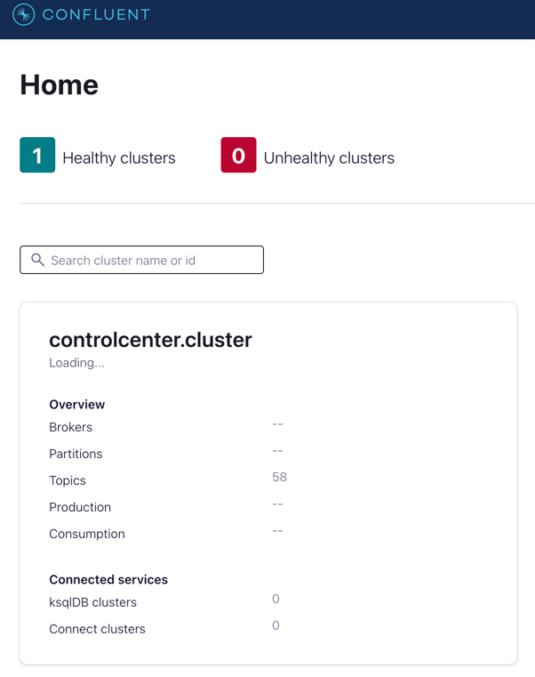
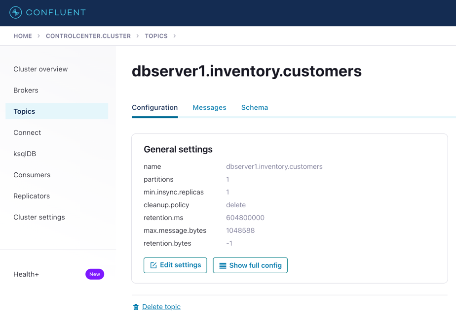
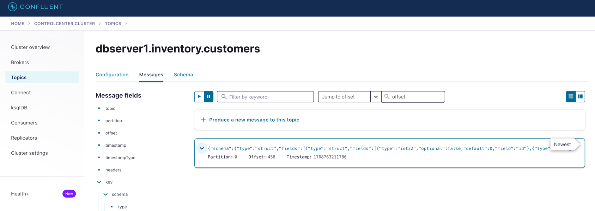
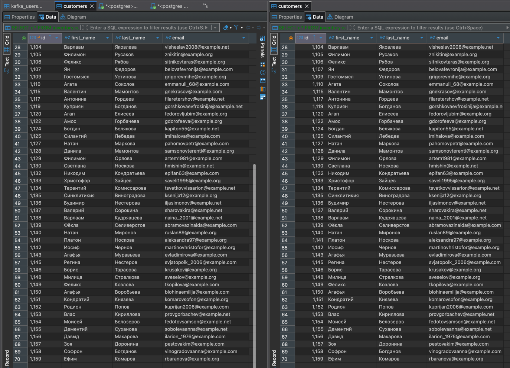

# Проект для работы с парттерном CDC, используя Postgres-Kafka-Debezium.

## 💻 Что в проекте

В данном проекте реализована настройка Debezium для поддержки CDC паттерна. 
В качестве источника данных используется Postgres, а для захвата изменений в таблицах источника используется Debezium совместно с Kafka.
В проекте используются следующие основные компоненты.

- ✔️ Docker - для сборки проекта.
- ✔️ Kafka + ZooKeeper - для реализации кластера брокера сообщений. 1 broker, 1 zookeeper.
- ✔️ Debezium коннектор для CDC. Он же Kafka Connect worker для CDC.
- ✔️ Confluent Control Center - мониторинг Kafka кластера.
- ✔️ Debezium UI - веб-интерфейс для управления коннекторами Debezium.
- ✔️ Postgres - две БД. Первая в качестве источника, где будут меняться данные. Вторая в качестве цели, которая будет получать изменения.
- ✔️ DuckDB - для манипуляций с DB Postgres.
- ✔️ Python - для генерации данных и изменения данных в исходной таблице, а также для считывания из Kafka и повторения этих изменений в целевой таблице.
- ✔️ UV - менеджер зависимостей.

## 📖 Описание

В этом проекте при запуске `main.py` выполняется основная логика проекта.
В `generate.py` реализован генератор событий изменения исходной таблицы - INSERT/UPDATE/DELETE.
В `consumer.py` реализован Kafka consumer, который считывает сообщения из Kafka topic для определенной таблицы. По полученному сообщению изменяются данные в целевой таблице.

В проекте реализованы следующие шаги:
- ✔️ Создаются схема и таблица в целевой базе данных.
- ✔️ Каждые 5 сек (можно изменить) генерируется событие в исходной таблице - INSERT/UPDATE/DELETE.
- ✔️ Debezium автоматически генерирует сообщение в соответствующем топике для таблице.
- ✔️ Consumer каждую секунду забирает сообщения из топика.
- ✔️ В python скрипте по полученному сообщению генерится запрос на INSERT/UPDATE/DELETE в целевой БД.

## 📁 Структура проекта

```text
Project-4-Debezium/
│
├── app/                       # Основной код приложения
│   ├── consumer/              # Скрипты для потребителей Kafka
│   │   └── consumer.py        # Kafka consumer для топиков Debezium и изменения записей в целевой DB
│   ├── utils/                 # Вспомогательные утилиты
│   │   ├── generate.py        # Генерация изменений записей в исходной DB
│   │   ├── postgres.py        # Работа с PostgreSQL
│   │   └── utils.py           # Общие вспомогательные функции
│   └── main.py                # Основной скрипт запуска приложения
├── docker-compose.yaml        # Конфигурация Docker Compose (Postgres, Kafka, Debezium, UI)
├── register-postgres.json     # Конфигурация коннектора Debezium для PostgreSQL
├── pyproject.toml             # Конфигурация Python-проекта / зависимостей
├── uv.lock                    # Lock-файл для управления зависимостями
└── README.md                  # Документация проекта
```

## 🚀 Установка

### Клонирование репозитория:

```bash
git clone https://github.com/KimAleksey/Debezium-CDC-Kafka.git
cd Debezium-CDC-Kafka
```

### Установка зависимостей

Установка uv
```bash
curl -LsSf https://astral.sh/uv/install.sh | sh
```
После установки перезапустить терминал.

Перейти в папку проетка
```bash
cd Debezium-CDC-Kafka
```

Создать виртуальное окружение
```bash
uv venv
```

Активировать виртуальное окружение
```bash
source .venv/bin/activate
```

Установить зависимости
```bash
uv sync
```

Создать файл окружения
```bash
cp .env.example .env
```
Если меняли порты в Docker-compose - поменяйте и в .env файле.

### Запуск проекта

```bash
docker compose up -d
```

### Зарегистрировать подключение

```bash
curl -i -X POST -H "Accept:application/json" -H  "Content-Type:application/json" http://localhost:8083/connectors/ -d @register-postgres.json
```

### Запуск программы

```bash
python3 -m app.main
```

## 🧑‍💻Работа с проектом

### Работа с Debezium (Kafka).

1. Перейти в http://localhost:9021/.



2. Перейдите в кластер и выберите топик dbserver1.inventory.customers.



3. Увидим сообщения.



4. В консоли можно увидеть вот такой лог:

```text
2026-01-18 22:06:57,713 | INFO | root | Подключение к целевому Postgres DB.
2026-01-18 22:06:57,743 | INFO | root | POSTGRES_HOST_TRG: localhost
2026-01-18 22:06:57,743 | INFO | root | POSTGRES_PORT_TRG: 5435
2026-01-18 22:06:57,744 | INFO | root | POSTGRES_DB_TRG: postgres
2026-01-18 22:06:57,764 | INFO | root | Подключение к Postgres успешно.
2026-01-18 22:06:57,774 | INFO | root | Схема inventory создана.
2026-01-18 22:06:57,775 | INFO | root | Таблица inventory.customers создана.
2026-01-18 22:06:57,871 | INFO | root | KAFKA_USERS_COORDINATES_TOPIC: dbserver1.inventory.customers
2026-01-18 22:06:57,871 | INFO | root | KAFKA_BOOTSTRAP_SERVER: localhost:9092
2026-01-18 22:06:57,954 | INFO | root | Получено сообщение с пустым Value. Пропускаем это сообщение.
2026-01-18 22:06:57,961 | INFO | root | Подключение к Postgres успешно.
2026-01-18 22:06:57,961 | INFO | root | Start execution.
2026-01-18 22:06:57,979 | INFO | root | Insert SQL: 
        INSERT INTO pg_src.inventory.customers (first_name, last_name, email)
        VALUES('Ефим', 'Комаров', 'rbaranova@example.org');
```

5. В DBeaver при подключении к Postgres как к источнику, так и к цели - можно увидеть, что записи двух таблиц совпадают.



### Информация по проекту

#### utils.py

Используется для получения секретов подключения к Postgres.

#### postgres.py

Используется для подключения к Postgres, а также для выполнения запросов как DDL, так и DML в подключенной базе.
Для подключения к Postgres используется DuckDB:

```python
# Подключаем DuckDB
con = duckdb.connect()

# Установка нужных коннекторов
con.execute("""
    INSTALL postgres; 
    LOAD postgres;
""")

# Подключение к Postgres
con.execute(f"""
ATTACH 
    'host={conn_params["host"]} 
     port={conn_params["port"]} 
     user={conn_params["user"]} 
     password={conn_params["password"]} 
     dbname={conn_params["database"]}' 
AS {alias} (TYPE postgres);
""")
```

Далее это подключение используется в остальных функциях, чтобы изменять данные в Postgres.

#### generate.py

Используется для генерации данных о пользователях, для этого используется библиотека Faker для имитации данных.

Данные в формате:
```python
record = {
    "first_name": first_name,
    "last_name": last_name,
    "email": email,
}
```

Скрипт генерирует раз в 5 секунд определенное событие в исходной базе данных - INSERT/UPDATE/DELETE.
Таблица в которой выполняются эти события - на контроле у Debezium.
При изменении записи в WAL в Kafka topic отправляется сообщение с содержанием изменений.


#### consumer.py

Используется для получения сообщений из topic и повторения операций в целевой таблице.

1. Подключаемся к topic.
2. Получаем сообщение.
3. В сообщении в поле op - лежит операция.

> Debezium присылает 3 типа сообщений:
> 1. **Insert** → after заполнено, before = null
> 2. **Update** → и before, и after заполнены
> 3. **Delete** → before заполнено, after = null

4. Далее с помощью DuckDB выполняется такая же операция в целевой базе данных.
5. В бесконечном цикле считываем сообщение из Topic.

Для этого:
> - Делаем poll для получения одного сообщения.
> - poll(timeout) пытается получить одно сообщение из Kafka.
> - Параметр 1.0 = тайм-аут в секундах, то есть poll будет ждать до 1 секунды, если сообщения пока нет. 
> - если сообщений нет после тайм-аута, poll возвращает None.
> - Если сообщение получено усепешно, то в целевой таблице выполняется та же операция, что и в источнике.